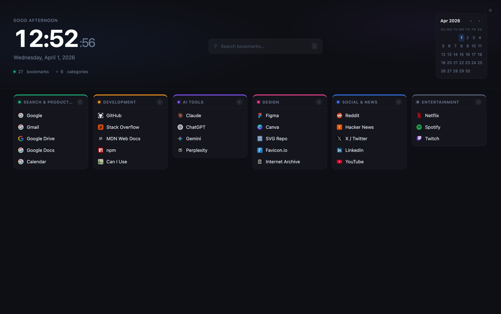

# StartDock

A personal new-tab dashboard for Chrome that replaces the default new-tab page with an organised, fast-access bookmark grid.

## Features

- **Organised bookmark grid** — group bookmarks into colour-coded categories
- **Two data sources** — use your own custom bookmarks or pull directly from Chrome's native bookmark bar
- **Live search** — filter bookmarks instantly by pressing `/`
- **Clock & calendar** — built-in clock with greeting and mini monthly calendar
- **Quick-add via context menu** — right-click any page and add it to a category without opening settings
- **Import / Export** — back up and restore your bookmark data as JSON
- **Sync across devices** — data is stored in `chrome.storage.sync`

## Installation

### From source (developer mode)

1. Clone or download this repository
2. Open Chrome and go to `chrome://extensions`
3. Enable **Developer mode** (toggle in the top-right corner)
4. Click **Load unpacked** and select the repository folder
5. Open a new tab — StartDock will appear

### From the Chrome Web Store

> Coming soon.

## Usage

### Custom bookmarks (default)

Bookmarks and categories are managed entirely within StartDock's settings page. Open it via the gear icon on the new-tab page or from `chrome://extensions`.

- **Add a category** — click "+ Add category", set a name and colour
- **Add a bookmark** — expand a category, click "+ Add bookmark"
- **Edit or delete** — use the pencil / × icons on any row
- **Quick-add** — right-click any page → *Add to StartDock*

### Native browser bookmarks

Switch the data source to **Browser bookmarks** in the settings page. StartDock will display your existing Chrome bookmarks read-only:

- Top-level bookmark folders → categories
- Nested bookmarks → flattened into the parent category
- Enable **"Show folder path in bookmark names"** to prefix each bookmark with its sub-folder path (e.g. `Tools / npm`)

To add, edit, or remove bookmarks in this mode, use Chrome's built-in bookmark manager (`Ctrl+Shift+O` / `⌘+Option+B`).

## Keyboard shortcuts

| Key | Action |
|-----|--------|
| `/` | Focus search bar |
| `Esc` | Clear search |

## Data & privacy

All bookmark data is stored locally in `chrome.storage.sync` and synced via your Google account. No data is sent to any external server. In native bookmarks mode, the extension reads (but never modifies) your browser bookmarks.

## Contributing

Pull requests are welcome. Please open an issue first to discuss any significant changes.

## License

[MIT](LICENSE)
